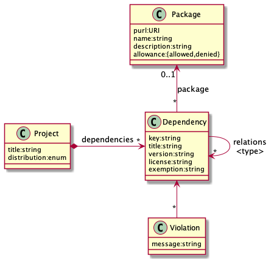
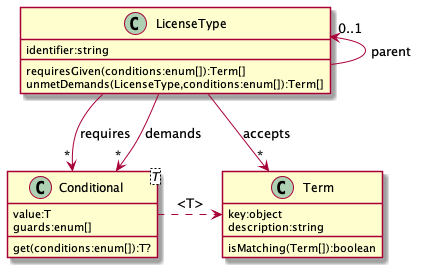

# BOM-bar Service Architecture

## Introduction

### Purpose
This document provides a comprehensive architectural overview of the system,
using a number of different architectural views to depict differnt aspects of
the system. It is intended to convey the significant architectural decisions
which have been made on the system.

### Scope
BOM-bar is an **experimental** service for raising policy violations in
uploaded Bill-of-Materials reports about (versions of) products and their
transitively dependent packages.

### Definition, Acronyms and Abbreviations
Term | Description
-----|------------
DSL  | "Domain-specific language" - A (meta) programming language to express domain-specific constraints.
PURL | Package URL
SPDX | "The Software Package Data Exchange" - An open standard for communicating software bill of material information, including components, licenses, copyrights, and security references. SPDX reduces redundant work by providing a common format for companies and communities to share important data, thereby streamlining and improving compliance.

### References
- [SDPX License list](https://spdx.org/licenses/)
- [The Software Package Data Exchange (SPDX®) Specification Version 2.2](https://spdx.github.io/spdx-spec/)

## Goals and constraints
Goals of the BOM-bar service are:

1. Raise per-project policy violations on uploaded Bill-of-Materials reports.
2. Provide insight into the shared (re-) use of internal and external packages.

The stakeholders of this application are:

- Product development teams, responsible for delivering products that comply with corporate policies.
- Legal professionals, responsible for maintaining the policies for the use of packages in products.
- CI/CD operators, responsible for running server.

The most significant requirements are:

- License compatibility violations shall be automatically raised.
- Manual exemptions shall suppress violations per project and per package.
- Bill-of-Materials reports shall be uploaded in SPDX format.

Design constraints are:

- Maintainability: Code must be easy to maintain for average programmers. This
  is why the code tries to adhere to "Clean Code" guidelines, and a strict
layering model is applied.

## Use-Case view

### Analyze bill-of-materials per project
1. The build pipeline of a project uploads an updated bill-of-materials file.
2. The system analyzes the packages and attributes and raises any violations.
3. The system reports the package structure and dentified violations per
project.
4. Project representatives use reported violations to improve compliance of the
product to policies.

### Maintain package allow- and denylists
1. A legal professional looks up a package by name.
2. A legal professional annotates the package for restricted use.
3. The system applies the package annotations while applying policies.

### Exemption
1. The system raises a policy violation.
2. A project representative asks the assigned legal professional to exempt the
package from the policy in the context of the project.
3. The legal professional indicates the violation of a policy is not applicable
to the specific project context.
4. The system ignores the exempted violations for the project.

### Use-case realization
The figure below provides the domain model for the system:



Upon uploading a new bill-of-materials report, the dependencies of a project are
updated. The system then evaluates the updated dependencies against the
policies to raise the appropriate violations.

## Logical view
### Overview
The BOM-bar service is a stand-alone application that persists its data in a
relational database and exposes a web user interface to its various users.

### Bill-of-material updates
Upon every new CI/CD build cycle of a product version in development, a new
bill-of-materials report is uploaded to the server. SPDX documents are full
snapshots of the current state of the product, and provide no guarantees about
the reuse of identification keys. Therefore each upload has to completely
replace the prior dependencies structure and its relations, and build a new
structure for the project.

The implication is that persistent decisions about projects and packages must
remain separate from the current dependency structure snapshot. This is solved
for projects by capturing all decisions at project level, and re-mapping them
to dependencies for every new snapshot. The key for this mapping is provided by
the package identifier part of the Package URL. Although this implies that
exemptions can only be provided for dependencies that are annotated with a
Package URL, it also allows for linking dependencies to persistent packages
definitions that are shared between projects.

The (version-independent) reuse of packages across projects and the origin of
versions of "internal" packages are captured for analysis by the relation
between dependencies and corresponding package.

## Process view
The service runs as a (containerless) web server, allocating a thread per
received web request without tracking sessions. All database access is handled
synchronously by the network thread.

## Deployment view
Although the data is persisted to an external H2 database, the driver
is included in the executable. This limits deployment to a single binary and a
storage location for the database. (The database schema is included as FlyWay
migrations and a JPA object-relation mapping using Hibernate.)

The web user interface is developed in a separate project, which yields
deployment artefacts that are copied into this project and served as static
resources from the service on port 8080.

All components are packaged in a single Docker container as defined in the
`docker` directory.

## Implementation view
### Overview
The service is coded in Java using Spring Boot to reduce boilerplate code for
web endpoint handling (using Spring MVC) and persistence of data (using JPA on
Hibernate) to a database.

### Layers
The figure below explains how the layers are represented in the source code:


The implication of this design is that external communication is completely
decoupled from the domain, because the controller layer can only interact with
the domain through a service facade using DTO POJO classes. Domain objects are
never directly exposed to the controller layer.

The "interactor" classes provide the implementation of the service definitions
to retrieve relevant domain classes from persistent storage, invoke the
appropriate methods on domain classes, and persist any state changes of domain
objects.

Persistence is isolated in the same way by providing specialized persistence
instances for domain classes that allow storage and retrieval of domain objects
without polluting the domain with annotations or additional fields.

### REST API
The REST API in the controller layer uses Spring Boot annotations to map routes
to functions that handle the web requests:

- `PackagesRoute` handles requests that refer to (project-independent)
  packages.
- `ProjectsRoute` handles requests related to project, dependencies and the
  import of bill-of-materials results..

All JSON request and response bodies are automatically mapped to Java classes
by a Jackson Object Mapper.

### License compatibility
Compatibility of licenses is a result of the compatibility of demands imposed
by licenses on their license context. This is modeled in the design by
(conditional) terms "demanded" and "accepted" by a license. If all demands are
accepted by enclosing licenses, the licenses are considered compatible. Else a
license compatibility violation is raised.

The figure below shows the classes involved in the definition of license types:



Each `LicenseType` defines a license with three types of properties:

- **requires** expresses the (conditional) prerequisites for using the license.
  (E.g.: The requirement to redistribute the source code of the package.)
- **demands** expresses the (conditional) compatibility conditions that need to
  be fulfilled by the licenses of enclosing packages.
- **accepts** expresses the compatibility conditions of other licenses that can
  be met by this license.

A license type can be derived from a parent license type. This can be used to
express common properties among a family of licenses, but also to encode a
license type with a SPDX "WITH" clause that relaxes some of the parent's
constraints.

Conditions are defined by the generic `Conditional` class, using (any type of)
enum values as guards. This class exposes its value only if the conditions
expressed by the guards are not met. An enum guard is met if the ordinal value
of the enum provided in the conditions is _lower_ than the guard. If no value
is provided for a guard, the guard is automatically ignored. 

To create meaningful violation messages, the concrete `Conditional` instances
are created for `Term` objects. License terms can be captured by (constant)
`String` keys, while copyleft constraints can be expressed by the `LicenseType`
as key of the `Term`. This allows `LicenseType` to extract the requirements of
a license, and identify any unmet demands given the context of another license.

### License definition DSL
To ease creation and maintenance of license definitions, a (primitive) DSL is
provided by the `LicenseRegistry` to configure the properties of and relations
between licenses. This DSL makes it easier to build the complex license
compatibility graph by specifying relations from the source license.

Condition guards are always expressed as the _minimal_ enum value required to
make the condition applicable. (E.g.: `Distribution.SAAS` expresses that the
condition only applies if the project is distributed as a SAAS or Proprietary
package, allowing unconditional distribution as open source and for strict
internal purposes.)

For example:

```java
// Register (conditional) term
private static final String ADVERTISING = "ADVERTISING"; // Define a term
REGISTRY.term(ADVERTISING, "Advertising clause");

// Define permissive licenses with shared advertising compatibility
REGISTRY.license("(permissive").accepts(ADVERTISING);
REGISTRY.license("MIT", permissive);
REGISTRY.license("BSD-4-Clause", permissive).demands(ADVERTISING);

// Define (un)conditional copyleft licenses with explicit compatibility
REGISTRY.license("MPL-1.0").copyleft();
REGISTRY.license("MPL-1.1").copyleft(Relationship.MODIFIED_CODE, Distribution.PROPRIETARY);
final var mpl2_0 = REGISTRY.license("MPL-2.0").copyleft(Relationship.STATIC_LINK)
	.compatibleWith(lgpl2_1, lgpl3);
```

### License validation
Licenses of dependencies are validated by the `LicenseChecker` class against
the license types declared in the provided `LicenseRegistry`.

Validation of each package starts by splitting the textual license
specification into a list of individual licenses while removing duplicates. The
licenses are then checked for compatibility against eachother to detect
incompatibility among the licenses of the same package.

Next, the licenses of underlying packages are checked per package (and per
license) against all licenses of the package. Violations are checked against
available exemptions and assigned with an explanation to the the relevant
package.

### Persistence of domain objects
To avoid pollution of domain classes by (JPA) persistence annotations, a part
of the ORM configuration is defined in the `orm.xml` file. Whenever additional
fields (like primary keys or additional foreign keys) are necessary for
persistence, subclasses with JPA annotations are used. Instances of these
classes are only created in the persistence layer. This setup avoids all
dependencies from the domain on the selected persistence mechanism.

(End of document)
